  

  
  

  

  <strong>From a founder-built product used by paying businesses to AI agents with control, recovery, telemetry, and measurable outcomes.</strong>

### Currently building

- **Autonomous Growth Organization** — six specialized agents coordinating research, strategy, campaigns, approvals, and learning.
- **Offline Code-Repair Agent** — local Qwen inference with structured patches, execution, validation, and retry recovery.

  

  <code>AI AGENTS</code> · <code>MCP</code> · <code>TOOL CALLING</code> · <code>EVALUATION</code> · <code>TELEMETRY</code>

---

  <strong>Give me a messy workflow—not a toy problem.</strong> 
  <a href="mailto:harshel333@gmail.com">harshel333@gmail.com</a>

