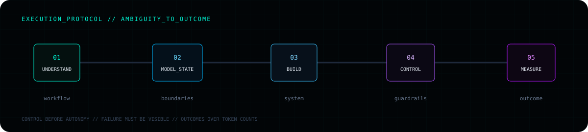

<p align="center"></p>

<p align="center">
  <a href="mailto:harshel333@gmail.com"></a>
  <a href="https://github.com/Harshel17?tab=repositories"></a>
  
</p>

## `01 // PROFILE_SIGNAL`

I’m a software engineer who has already crossed the line from **building projects** to **shipping products**. I took OGym from a blank page to paying B2B customers, then carried that founder-level ownership into agent systems and operational software.

> **Operating mode:** enter an ambiguous workflow → identify the failure points → design the state and boundaries → ship the complete system → measure the outcome.

<p align="center"></p>

## `02 // SYSTEM_RECORDS`

### `OGYM // PRODUCT_DEPLOYED`

AI-powered, multi-tenant gym platform across web and mobile. Built through direct conversations with gym owners and members.

- **Proof:** 2 paying B2B gyms · 50+ active members · 200+ downloads
- **Stack:** `Django` `React` `PostgreSQL` `AWS` `OAuth 2.0` `MCP`

### `AGENT_ECONOMICS // VALUE_OBSERVABILITY` · [OPEN REPOSITORY →](https://github.com/Harshel17/agent-economics)

Attributes AI-model and infrastructure spend to executions, verified outcomes, confidence, and optimization opportunities.

- **Proof:** $11,200 cost · 25,000 runs · 15,500 outcomes · **$0.72 per successful outcome**
- **Stack:** `FastAPI` `React` `TypeScript` `SQLAlchemy` `Telemetry`

### `RESERVEGUARD // MULTI_AGENT_RECOVERY`

Predicts rental fulfillment risk and orchestrates recovery across customers, renters, and managers with simulation, voice, approvals, takeover, and audit trails.

- **Proof:** seeded incident recovered from **13% confidence to 86% on track**
- **Stack:** `FastAPI` `React` `SQLAlchemy` `Voice Agents` `Decision Systems`

### `MERIDIAN // AGENT_EXECUTION` · [OPEN REPOSITORY →](https://github.com/Harshel17/meridian-demo)

Seven-step sales-research workflow with step-level execution, infrastructure, and outcome telemetry connected to Agent Economics.

- **Proof:** complete agent → telemetry → economics → verified-outcome trail
- **Stack:** `Python` `FastAPI` `React` `Agent Workflows` `Telemetry`

## `03 // EXECUTION_PROTOCOL`

<p align="center"></p>

- `PRODUCT_JUDGMENT` — find the real workflow problem before building
- `SYSTEMS_ENGINEERING` — model APIs, data, state, permissions, and multi-tenant boundaries
- `APPLIED_AI` — agents with tools, evaluations, guardrails, and human control
- `OWNERSHIP` — ambiguity through deployment, recovery, iteration, and outcome measurement

## `04 // TOOLCHAIN`

<p>


</p>

`AI_AGENTS` · `MCP` · `RAG` · `TOOL_CALLING` · `EVALUATIONS` · `LLM_APIS` · `OAUTH_2.0` · `JWT` · `RBAC` · `MULTI_TENANCY` · `CI/CD`

## `05 // CURRENT_PROCESS`

```text
focus       = mature multi-agent products for operational workflows
roles       = software engineering | applied AI | forward deployed | full-stack
education   = M.S. Computer Science, University of Alabama at Birmingham
best_mode   = important + ambiguous + end-to-end ownership
status      = OPEN_TO_ENGINEERING_ROLES
```

---

<p align="center">
  <code>root@harshel:~$ solve --workflow="messy" --ship --measure</code><br/><br/>
  <strong>Give me the messy workflow. I’ll show you the system.</strong><br/><br/>
  <a href="mailto:harshel333@gmail.com">harshel333@gmail.com</a>
</p>