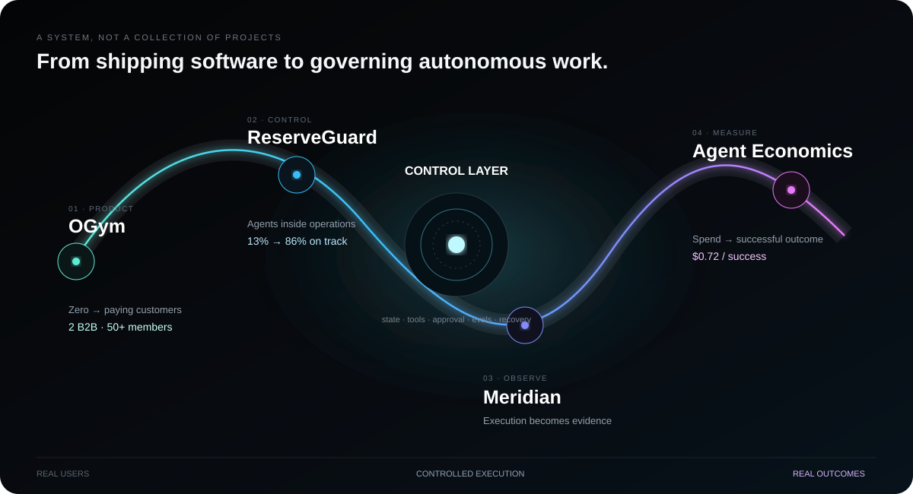

  

  
  

  

  <strong>I went from building a product for real customers to building the control plane around production AI.</strong> 
  Agents with explicit state, bounded tools, human approval, evaluation, recovery, telemetry, and measurable outcomes.

  

  <code>AI AGENTS</code> · <code>MCP</code> · <code>TOOL CALLING</code> · <code>EVALUATION</code> · <code>TELEMETRY</code>

---

  <strong>Give me a messy workflow—not a toy problem.</strong> 
  <a href="mailto:harshel333@gmail.com">harshel333@gmail.com</a>

