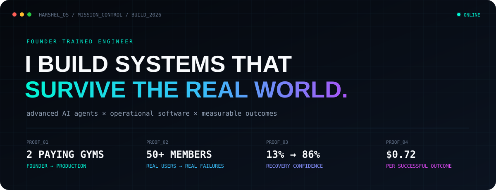
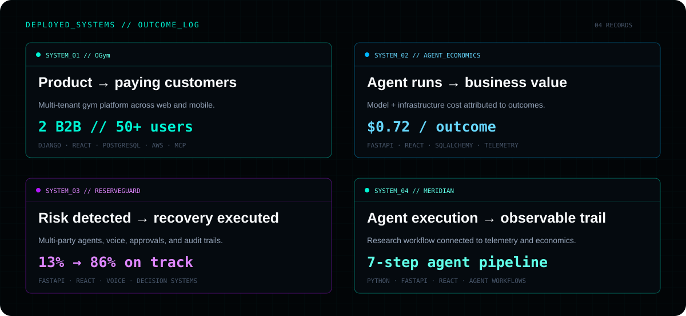

  
  
  

## The short version

I built **OGym for 2.5 years**—from the first idea through a live web product, an App Store release, paying gyms, active members, and the production failures that only appear after people depend on your software.

That changed how I approach AI. I’m not interested in agents that only produce convincing demos. I build the surrounding system: **state, tools, permissions, evaluation, human control, recovery, telemetry, and a measurable outcome.**

## Four projects, one engineering direction

### 🏋️ OGym — learning what “production” actually means

An AI-powered, multi-tenant gym platform built from direct conversations with gym owners and members.

- Shipped a live web application and App Store mobile app
- Reached **2 paying B2B gyms, 50+ active members, and 200+ downloads**
- Worked through multi-tenancy, OAuth, JWT, production database migrations, cloud deployment, and B2B/B2C product decisions
- Built with `Django`, `React`, `PostgreSQL`, `AWS`, `OAuth 2.0`, and `MCP`

### 🚗 ReserveGuard — agents operating inside a real workflow

Rental reservations fail because inventory, returns, cleaning, transfers, customers, and managers all move independently. ReserveGuard models that operational state and coordinates recovery before pickup.

- Simulates same-branch, upgrade, transfer, alternate-branch, and early-return strategies
- Supports customer and renter conversations, voice, manager approval, takeover, and audit history
- Recovered a seeded incident from **13% confidence to 86% on track**
- Built with `FastAPI`, `React`, `SQLAlchemy`, voice agents, and deterministic policy logic

### 🔎 [Meridian](https://github.com/Harshel17/meridian-demo) — making the agent observable

A seven-step sales-research agent where every step produces an execution, infrastructure, and business-outcome trail.

- Shows what the agent did, which resources it used, what it cost, and whether the result passed evaluation
- Connects agent execution to attribution instead of treating the workflow as a black box
- Built with `Python`, `FastAPI`, `React`, workflow orchestration, and telemetry

### 📊 [Agent Economics](https://github.com/Harshel17/agent-economics) — making the outcome measurable

A cost-and-value layer that connects model and cloud spend to successful business outcomes.

- Maps **$11,200** in attributable cost across **25,000 runs** and **15,500 qualified outcomes**
- Calculates **$0.72 per successful outcome**
- Surfaces optimization evidence, attribution confidence, evaluation, approval, and post-change verification
- Built with `FastAPI`, `React`, `TypeScript`, `SQLAlchemy`, and telemetry ingestion

## What is consistent across my work

| I look for | I build |
|---|---|
| The real failure point inside the workflow | Explicit state, boundaries, and recovery paths |
| Actions an agent should and should not take | Tool contracts, permissions, policy, and approval |
| Evidence that explains what happened | Evaluation, telemetry, attribution, and audit trails |
| A result the business actually cares about | Cost, confidence, successful outcomes, and iteration |

## Tools I use

`Python` · `TypeScript` · `Java` · `FastAPI` · `Django` · `React` · `Next.js` · `PostgreSQL` · `MongoDB` · `AWS` · `Docker` · `CI/CD`

`AI Agents` · `MCP` · `RAG` · `Tool Calling` · `Evaluations` · `OAuth 2.0` · `JWT` · `RBAC` · `Multi-tenancy`

## Right now

- Building mature multi-agent products for operational workflows
- Exploring **Software Engineering, Applied AI, Forward Deployed, and Full-Stack** roles
- Best when the problem is ambiguous and needs both engineering depth and product ownership
- M.S. in Computer Science — University of Alabama at Birmingham

---

  <strong>Give me a messy workflow, not a toy problem.</strong> 
  I’ll map where it breaks, build the system around it, and show you what changed.  
  <a href="mailto:harshel333@gmail.com">harshel333@gmail.com</a>

