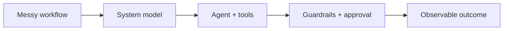

  

  
  
  

## I build systems that finish the job

I'm a software engineer and former solo founder. I don't stop at an AI demo—I build the product around it: data models, APIs, permissions, evaluation, human approval, observability, deployment, and measurable outcomes.

> **My edge:** I can sit with an unclear business problem, find the real failure point, and turn it into working software people can use.

<table>
  <tr>
    <td align="center"><strong>2</strong> paying B2B gyms</td>
    <td align="center"><strong>50+</strong> active members</td>
    <td align="center"><strong>200+</strong> mobile downloads</td>
    <td align="center"><strong>$0.72</strong> cost per agent outcome</td>
  </tr>
</table>

## Selected systems

<table>
<tr>
<td width="50%" valign="top">

### 🏋️ OGym
**A real product, not a portfolio exercise**

Built and launched an AI-powered, multi-tenant gym platform as a solo founder: web app, App Store mobile app, member experience, owner dashboard, authentication, payments-related workflows, and cloud deployment.

**Proof:** 2 paying B2B gyms · 50+ active members · 200+ downloads

`Django` `React` `PostgreSQL` `AWS` `OAuth 2.0` `MCP`

</td>
<td width="50%" valign="top">

### 📊 [Agent Economics](https://github.com/Harshel17/agent-economics)
**Measure AI by business outcomes**

Connects inference and infrastructure spend to agent executions, successful outcomes, attribution confidence, and optimization opportunities.

**Proof:** $11,200 → 25,000 runs → 15,500 qualified leads → **$0.72/outcome**

`FastAPI` `React` `TypeScript` `SQLAlchemy` `Telemetry`

</td>
</tr>
<tr>
<td width="50%" valign="top">

### 🚗 ReserveGuard
**Multi-party recovery before failure**

Predicts reservation fulfillment risk, simulates recovery strategies, coordinates customers, renters and managers, and supports voice conversations, approvals, takeover, and audited decisions.

**Proof:** seeded incident recovered from **13% confidence to 86% on track**

`FastAPI` `React` `Agents` `Voice` `Decision Systems`

</td>
<td width="50%" valign="top">

### 🔎 [Meridian](https://github.com/Harshel17/meridian-demo)
**Agent execution with an economic trail**

A seven-step sales-research agent that sends execution, infrastructure, and outcome telemetry into Agent Economics—from prospect research to measurable business value.

**Proof:** complete agent → telemetry → economics workflow

`Python` `FastAPI` `React` `Agent Workflows` `Telemetry`

</td>
</tr>
</table>

## How I engineer AI products

I care about the parts between the model call and the business result:

- **Control:** permissions, tool contracts, deterministic rules, and human approval
- **Reliability:** evaluation, failure handling, audit trails, and observable execution
- **Product:** workflows that make sense to the people actually doing the job
- **Economics:** cost per successful outcome—not just tokens, calls, or impressive demos

## Technical toolkit

  
  
  
  
  
  
  
  
  
  
  
  
  
  
  
  

## The person behind the code

- 🎓 M.S. in Computer Science, University of Alabama at Birmingham
- 🚀 Built a startup product from zero to paying customers
- 🧭 Looking for **Software Engineering, Applied AI, Forward Deployed, or Full-Stack** roles
- 🛠️ Most useful when the problem is important, ambiguous, and needs real ownership
- 🤝 Happy to prove fit through a technical assignment or a real workflow

  <strong>Have a messy workflow that should be software?</strong> 
  <a href="mailto:harshel333@gmail.com">Send it to me—I’ll show you how I think.</a>

